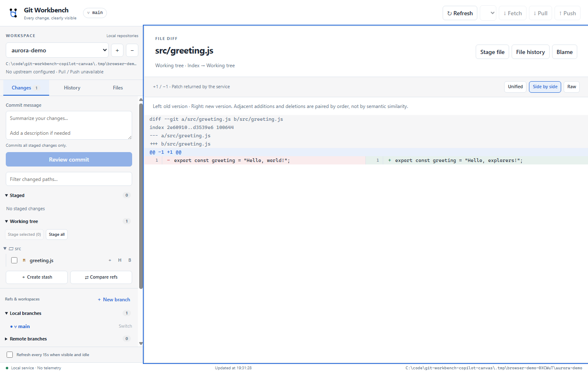

# Git Workbench — A Canvas for the GitHub Copilot App

**Git Workbench** brings repository trees, diffs, history, and deliberately confirmed Git operations into a visual canvas beside your Copilot conversation.

**Preview: `0.1.0-preview.1` · Windows-first · MIT**

Install directly from this GitHub repository. No manual clone, build step, or GitHub Release is required.



*Standalone browser rendering with synthetic demo data; not the Copilot App chrome.*

[View the original concept illustration](assets/preview.svg). *Illustration — synthetic demo data, not a screenshot.*

## What you can do

- Browse a multi-repository SCM tree with **staged changes, working changes, and conflicts**.
- Inspect **unified, split, and raw diffs**.
- Explore paginated commit history and its parent graph.
- Browse **local branches, remote branches, tags, remotes, stashes, and worktrees**.
- Read blame and file history, inspect commits, and compare refs without checking them out.
- Stage and unstage changes; commit the index; create or switch local branches; fetch, fast-forward-only pull, push to an existing upstream, and push/apply/pop stashes.

The agent-facing canvas actions are **`catalog`, `context`, and `read` only**. Git mutations are available through the canvas UI, not agent actions.

## Requirements

- **GitHub Copilot App preview with Canvas rendering and plugin-contributed extension support enabled.** Availability depends on your build and account. Plugin installation in the terminal-only Copilot CLI does **not** supply the visual renderer.
- **Node.js 22 or newer**, available to the host, and a modern **Git** on `PATH` with `git switch`, `git restore`, worktree support, and porcelain v2 status.
- **Windows first.** Other platforms are not fully supported or validated by this preview.
- A local Git working tree you trust, plus your own Git identity, credentials, and upstream configuration where needed.

The extension uses Node ES modules and has no third-party runtime dependencies. Copilot resolves `@github/copilot-sdk/extension` from the host automatically: **do not install or bundle the SDK**. The root `package.json` is private development/release tooling, not an npm distribution.

## Install

### From GitHub (one command)

```powershell
copilot plugin install formulahendry/git-workbench-copilot-canvas
```

Copilot downloads the plugin source for you. Restart or start a new **Copilot App** session, then ask:

> Open Git Workbench for this repository

The CLI and App must use the same Copilot home/profile. A terminal-only CLI can install the plugin but cannot render its canvas.

### Through a marketplace

Direct repository installs work in Copilot CLI 1.0.80-1, but that build marks them deprecated. Use this marketplace route if your CLI warns about or no longer supports direct installs:

```powershell
copilot plugin marketplace add formulahendry/git-workbench-copilot-canvas
copilot plugin install git-workbench@git-workbench-marketplace
```

In App builds with **Customize → Plugins → Add custom marketplace**, enter `https://github.com/formulahendry/git-workbench-copilot-canvas` and install **git-workbench**. Labels and availability can differ between preview builds.

Both CLI routes install repository source, not a Release archive. The current marketplace follows the default branch and is **not pinned to a release SHA**. Choose one route; do not install duplicate providers. A local checkout is needed only for [development](CONTRIBUTING.md#local-setup).

### Update or uninstall

Update a direct repository installation:

```powershell
copilot plugin update git-workbench
```

For a marketplace installation, refresh the catalog first:

```powershell
copilot plugin marketplace update git-workbench-marketplace
copilot plugin update git-workbench
```

Remove the plugin:

```powershell
copilot plugin uninstall git-workbench
```

If desired, remove its marketplace afterward with `copilot plugin marketplace remove git-workbench-marketplace`. Use the App's plugin controls to disable without uninstalling where supported. Restart the session to stop an already running provider. Repository catalogs and preferences are preserved; see [local data](#local-data-and-privacy).

## Open Git Workbench

In a compatible App session, ask:

> Open Git Workbench for this repository

Or provide an explicit local repository path:

> Open Git Workbench for `C:\src\aurora-demo`.

The stable plugin name, canvas ID, and extension folder name are all **`git-workbench`**. The canvas open input accepts `repoPath`; an optional `repositories` array registers additional repository roots.

Initial selection follows this order:

1. An explicit **`repoPath`**.
2. The session context's **`workingDirectory`**, resolved to its actual Git working tree, including a linked worktree.
3. The **last manually selected repository**, when there is no repository in the session context.
4. No selection, if none of those applies.

It does not substitute a project's main checkout for the session's worktree. Selecting a repository or reopening the canvas defaults history to **`HEAD`**; `historyRef` is never restored from saved preferences. Opening the canvas, choosing a repository, or viewing a branch/ref does **not** switch the Git checkout.

## Git operations: preview before execution

Every UI mutation follows **prepare → explicit confirmation → one-shot execution**. The preview shows the target and commands. A repository fingerprint is rechecked before execution; a changed repository requires a fresh preview and confirmation. Confirmations expire and cannot be reused.

| Operation | Scope and guardrails |
| --- | --- |
| Stage / unstage | Selected paths, or all where offered. Unstaging preserves working files. |
| Commit | **All staged changes only**; unstaged and untracked content is not automatically added. Conflicts and in-progress Git operations must be resolved first. |
| Create / switch branch | Creates and switches to a new local branch, or switches to an existing local branch. Requires a clean working tree and no in-progress operation. |
| Fetch | A configured remote; no automatic merge or pruning. |
| Pull | Existing upstream on a local branch, clean state, **fast-forward only**, no rebase. Divergence is refused. |
| Push | Existing upstream on a local branch; **non-force**, one upstream branch, no automatic tag publishing. Configure the upstream outside the canvas first. |
| Stash push | Eligible tracked changes, optionally untracked files; no conflicts/in-progress operation. |
| Stash apply / pop | Existing stash and a clean working tree; conflicts may still need manual resolution. Pop only drops the stash if Git applies it successfully. |

There is no hard reset, working-file discard, force push, or automatic conflict resolution. A read-only agent action is not a permission boundary for other independently available agent tools.

**Writes are not transactions.** Git hooks, credential helpers, configuration, remote services, and the filesystem can have effects beyond the displayed command. An error or timeout may follow a partially successful write. **Never automatically retry writes.** Refresh and inspect the repository and, for network operations, the remote before deciding whether to prepare a new operation.

`refresh_failed_after_write` specifically means the Git command completed but the follow-up refresh failed; it does **not** mean the write should be repeated.

## Local data and privacy

The renderer is served from a per-panel **`127.0.0.1` loopback** server with Host checking, Origin validation, a per-instance token, and a restrictive Content Security Policy. These are local request protections, **not a sandbox**: extensions execute with your user account's rights. Only open repositories and install extension source you trust. Git may run configured hooks, credential helpers, filters, and network commands. See [Security](SECURITY.md).

User-global data is stored outside the plugin installation/cache:

```text
$COPILOT_HOME\extensions\git-workbench\artifacts\repositories.json
```

`COPILOT_HOME` defaults to `~\.copilot`. The existing catalog format remains version 1, with an optional `preferences` object on each repository entry. It contains local repository paths/names, the last manual selection, and bounded preferences scoped to each repository:

- `tab`, `diffMode`, `autoRefresh`
- `remote`, `fileSearch`, `changeFilter`
- `expanded` tree state

Saved preferences do **not** include the history ref, canvas URL/token, confirmations, or drafts such as commit messages. Search/filter text is limited to 512 characters, the remote setting to 1,024 characters, and expanded tree state to 256 keys of at most 1,024 characters each with boolean values.

Only explicitly changed fields are persisted. Catalog locking and atomic writes merge concurrent patches to different fields; for the same field, the last completed write wins. A preference-load failure displays an error rather than silently replacing saved values with defaults.

There is **no automatic browser `localStorage` migration**. Previous loopback ports/origins cannot safely be rediscovered, so earlier origin-scoped settings are not imported. Without durable saved preferences, the new settings start from defaults and persist in the catalog as you use them.

Removing a repository from the catalog clears that entry's saved preferences and, if applicable, its last-selection marker. It does **not** delete the repository's directory, worktree, or Git history. Plugin updates/uninstall preserve the separate artifact location. Repository paths, filters, and selected remote names may still be sensitive: do not publish your catalog, logs, token-bearing URLs, or installed state directory.

### Manually clear saved data

First close Git Workbench and stop **all** App/CLI sessions that could run its provider. Optionally back up the catalog privately. To clear only this extension's saved catalog, selection, and preferences:

```powershell
$copilotHome = if ($env:COPILOT_HOME) { $env:COPILOT_HOME } else { Join-Path $HOME ".copilot" }
$artifacts = Join-Path $copilotHome "extensions\git-workbench\artifacts"
$catalog = Join-Path $artifacts "repositories.json"
if (Test-Path -LiteralPath $catalog) {
  Remove-Item -LiteralPath $catalog -ErrorAction Stop
}
```

Only if every provider is stopped and a stale catalog lock remains, remove the specific `repositories.json.lock` file in that same artifact directory. Do not recursively remove `extensions`, the plugin cache, or any repository. If unsure which process owns a lock, leave it in place.

## Limitations and troubleshooting

- This is a focused Git workbench, **not a full GitLens replacement** or a complete Git client. No clone/init UI, merge/rebase/cherry-pick workflows, conflict editor, branch/tag deletion, remote editing, worktree creation/removal, hard reset, or force push is provided.
- Tree categories reflect the selected repository; some can legitimately be empty. A displayed category is not a promise of every possible operation on that category.
- Reads have size/time bounds. Normal Git command output is capped at 12 MiB, reads normally time out after 25 seconds, and write commands have a 120-second timeout. History is paginated (up to 200 commits per request); file listings are bounded (up to 2,000 entries). Large/binary content and very large repositories can exceed what the preview displays.
- If the canvas is missing, check your App build's Canvas/plugin support, plugin enablement, discovery location, and duplicate providers. Restart/new session may be required. Installation success is not a visual smoke test.
- If you previously installed a standalone Git Workbench extension manually, disable that old provider before using the plugin. Keep its `artifacts` directory intact; new users do not need a migration step. See [Security](SECURITY.md#local-data).
- If a repository is missing/moved, choose its actual local worktree path or remove and re-add the catalog entry. Refresh after changing Git state outside the canvas.
- For stale confirmations, refresh and prepare again. For write errors/timeouts, inspect state first; **do not automatically retry**.
- Host integration and platform compatibility must be verified in a compatible App. Source installation does not by itself establish App-rendering compatibility.

## Development and references

```powershell
npm run check
npm test
npm run validate
npm run pack
```

No dependency installation is needed for these Node-based checks. Packing is an optional maintainer task, not an installation requirement. See [Contributing](CONTRIBUTING.md), [Changelog](CHANGELOG.md), [Security](SECURITY.md), and [Packaging and releases](docs/RELEASING.md).

Installation syntax and marketplace behavior follow GitHub's official references:

- [CLI plugin reference](https://docs.github.com/en/copilot/reference/copilot-cli-reference/cli-plugin-reference)
- [Creating a plugin marketplace](https://docs.github.com/en/copilot/how-tos/copilot-cli/customize-copilot/plugins-marketplace)
- [Finding and installing plugins](https://docs.github.com/en/copilot/how-tos/copilot-cli/customize-copilot/plugins-finding-installing)

## License

[MIT](LICENSE) — Copyright (c) 2026 formulahendry. Git Workbench is an independent project, not an official GitHub product.
